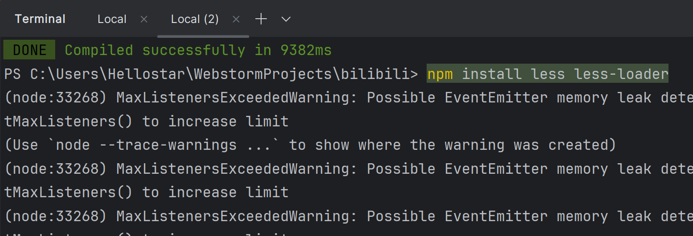
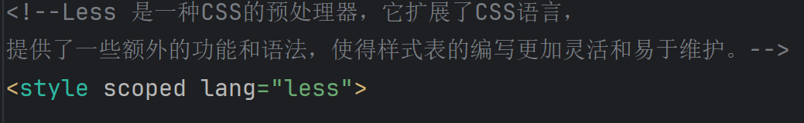

# 在项目中引入Less

Less 是一种CSS的预处理器，它扩展了CSS语言，
提供了一些额外的功能和语法，使得样式表的编写更加灵活和易于维护。\
Less 允许使用变量、嵌套规则、运算、混合（Mixin）、导入等功能，
这些特性在纯 CSS 中是不支持的。

### 一、在项目中打开terminal，使用npm进行安装
执行以下命令：
    
    npm install less less-loader
如下图所示：

### 二、在项目代码中使用Less

在项目vue组件中的style标签里，添加lang="less"即可使用。\
如下图所示：

