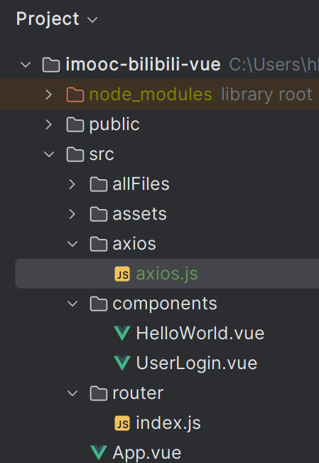

# 安装配置Axios

Axios是一个非常流行的JavaScript HTTP客户端库，用于在前端应用中进行网络请求和数据交互。

### 一、使用npm安装Axios
在webstorm中打开terminal，使用以下命令安装Axios：

    npm install axios

### 二、在项目中配置Axios
1、在项目src目录下新建axios文件夹，在axios文件夹下新建axios.js文件

2、在axios.js文件里，复制以下内容：

    import axios from 'axios';
    
    const httpRequest = axios.create({
        // 请求的后端接口的基础路径
        baseURL: process.env.VUE_APP_BACKEND_BASE_URL,
        // 接口超时响应时间
        timeout: 10000
    });
    
    export default httpRequest
